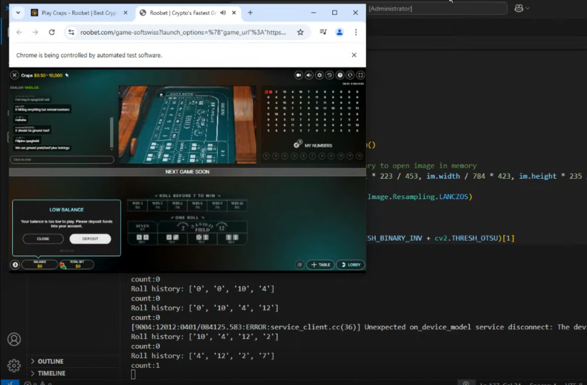

# 🧭 TradeCopier

A web app for group trading and copying orders across sub-accounts, with real-time market data, PnL monitoring, and Tradovate integration.

---

## 📚 Table of Contents

- [About](#-about)
- [Features](#-features)
- [Tech Stack](#-tech-stack)
- [Installation](#️-installation)
- [Usage](#-usage)
- [Configuration](#-configuration)
- [Screenshots & Demo](#-screenshots--demo)
- [API Documentation](#-api-documentation)
- [Troubleshooting](#-troubleshooting)
- [Acknowledgements](#-acknowledgements)
- [License](#license)

---

## 🧩 About

TradeCopier provides an intuitive interface for managing group-based trading and copying orders across sub-accounts. It solves the need to route and mirror trades in real time while keeping accounts, orders, and positions in sync. The project combines a lightweight **React + TypeScript** frontend with a **FastAPI** backend and integrates **Tradovate** for execution and market data, plus **DataBento**-style SSE streams for PnL and price snapshots.

Key goals:

- Centralized order routing (market, limit, optional SL/TP) for groups
- Real-time quotes and PnL via WebSocket and server-sent events
- Account, order, and position syncing with a clean dashboard

---

## ✨ Features

- **Group-based order routing** – Route market/limit orders (optional SL/TP) across sub-accounts from a single interface
- **Real-time quotes** – Live price stream via Tradovate WebSocket and complementary SSE endpoints
- **Live PnL stream and dashboard** – Server-sent events for PnL and current-price updates with fallback when market is closed
- **Account, order, and position syncing** – Broker accounts, orders, and positions kept in sync with the backend

---

## 🧠 Tech Stack

| Category   | Technologies |
|-----------|--------------|
| **Languages** | Python, TypeScript, JavaScript |
| **Frameworks** | FastAPI, React, Vite |
| **Database** | PostgreSQL (async via SQLAlchemy + asyncpg) |
| **Tools** | Tailwind CSS, Axios, Lightweight Charts, Tradovate API, DataBento-style SSE |

---

## ⚙️ Installation

```bash
# Clone the repository
git clone https://github.com/yourusername/TradeCopier.git

# Navigate to the project directory
cd TradeCopier
```

### Backend

```bash
cd backend
pip install -r requirements.txt
# Configure .env (see Configuration)
# Run migrations / DB setup as per backend/README.md
```

### Frontend

```bash
cd frontend
npm install
```

---

## 🚀 Usage

### Backend

From the project root:

```bash
cd backend
uvicorn main:app --reload --host 0.0.0.0 --port 8000
```

(Or use the run command documented in `backend/`.)

### Frontend

```bash
cd frontend
npm run dev
```

Then open your browser and go to:

👉 [http://localhost:5173](http://localhost:5173)

*(Vite default port is 5173; adjust if your config differs.)*

---

## 🧾 Configuration

### Frontend

Create `frontend/.env` (or `.env.local`) with:

```env
VITE_BACKEND_URL=http://localhost:8000
```

If omitted, the app defaults to `http://localhost:8000` (or `http://localhost:8000/api/v1` where used in API modules).

### Backend

Copy `backend/env.example` to `backend/.env` and fill in your values. Required and optional variables:

| Group | Variables |
|-------|-----------|
| **Database** | `DATABASE_URL`, `ASYNC_DATABASE_URL` (use `postgresql+asyncpg://...` for async) |
| **App** | `FRONTEND_URL`, `DEBUG`, `ENVIRONMENT`, `APP_VERSION`, `APP_ID` |
| **JWT** | `SECRET_KEY`, `ALGORITHM`, `ACCESS_TOKEN_EXPIRE_MINUTES` |
| **Email (EmailJS)** | `EMAILJS_SERVICE_ID`, `EMAILJS_OTP_TEMPLATE_ID`, `EMAILJS_PUBLIC_KEY`, `EMAILJS_RRIVATE_KEY`, `OTP_EXPIRE_MINUTES` |
| **Google OAuth** | `GOOGLE_CLIENT_ID` |
| **Tradovate** | `CID`, `SEC`, `TRADOVATE_LIVE_API_URL`, `TRADOVATE_DEMO_API_URL`, `TRADOVATE_REDIRECT_URL`, `TRADOVATE_AUTH_URL`, `TRADOVATE_EXCHANGE_URL`, `TRADOVATE_API_ME_URL` |
| **Market data** | `DATABENTO_KEY` |

Backend requires valid **Tradovate** API credentials for execution and WebSocket tokens. For SSE/DataBento PnL and price streams, set **DATABENTO_KEY** and ensure the corresponding endpoints are configured.

---

## 🖼 Screenshots & Demo

### 🎬 Loom video

Watch a short walkthrough of TradeCopier:

**[▶ Watch on Loom](https://www.loom.com/share/7456d5db2d7a4b18b128bf16fa26a8a0)**  

---

### Screenshots



Add more images to `docs/images/` and reference them with ``.

---

## 📜 API Documentation

The backend exposes REST and SSE endpoints. Summary:

### Broker / account

| Method | Endpoint | Description |
|--------|----------|-------------|
| GET | `/api/v1/broker/positions` | List positions |
| GET | `/api/v1/broker/orders` | List orders |
| GET | `/api/v1/broker/accounts` | List broker accounts |

### Order execution

| Method | Endpoint | Description |
|--------|----------|-------------|
| POST | `/api/v1/broker/execute-order/market` | Submit market order |
| POST | `/api/v1/broker/execute-order/limit` | Submit limit order |
| POST | `/api/v1/broker/execute-order/limitwithsltp` | Submit limit order with SL/TP |

### Tradovate / market data

| Method | Endpoint | Description |
|--------|----------|-------------|
| GET | `/api/v1/broker/websockettoken` | Get Tradovate WebSocket token |
| GET | `/databento/market-status` | Market open/closed status |
| GET | `/databento/historical` | Historical snapshot |
| POST | `/databento/sse/current-price` | Start current-price SSE |
| GET | `/databento/sse/pnl?user_id=<id>` | PnL SSE stream |

Adjust base paths if your backend uses different prefixes. For full API details, see the backend docs or OpenAPI schema (e.g. `/docs` when the server is running).

---

## 🔧 Troubleshooting

- **No quotes updating** – Check `VITE_BACKEND_URL` and that `GET /api/v1/broker/websockettoken` returns an access token. Ensure backend has valid Tradovate credentials and market data permissions.
- **SSE not connecting** – Verify CORS and cookies; frontend uses `axios.defaults.withCredentials = true`. Ensure backend SSE endpoints are reachable and not blocked by a proxy.
- **Symbols not found / market closed** – The UI falls back to a historical snapshot and marks the price stream idle when the market is closed or the API key is missing.

---

## 🌟 Acknowledgements

- [Tradovate API](https://www.tradovate.com/) and [example-api-js (WebSockets)](https://github.com/tradovate/example-api-js/tree/main/tutorial/WebSockets) for market data and execution
- DataBento-style SSE for PnL and current-price streams
- Libraries: FastAPI, React, Vite, Tailwind CSS, Lightweight Charts, Axios

---

## License

Proprietary (update as appropriate).
